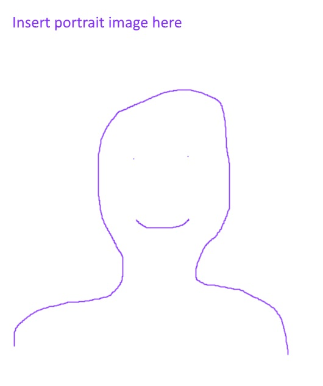

# Current students

The template below should be removed once actual student profiles are added.

## Jane Student

Expected graduation: May 2023 
GitHub account: [lvclark](https://github.com/lvclark) 
[LinkedIn Profile](https://www.linkedin.com/in/lindsay-clark-75539aa9/)

**Project highlights:**
* [polyRAD](https://github.com/lvclark/polyRAD): Genotype calling with
uncertainty from sequencing data in polyploids
* [R functions to estimate genetic correlations](https://github.com/lvclark/quant_gen)

**Interests:**
* Bioinformatics
* Plant breeding

**Technical skills:**
* fluent in R
* proficient in Python
